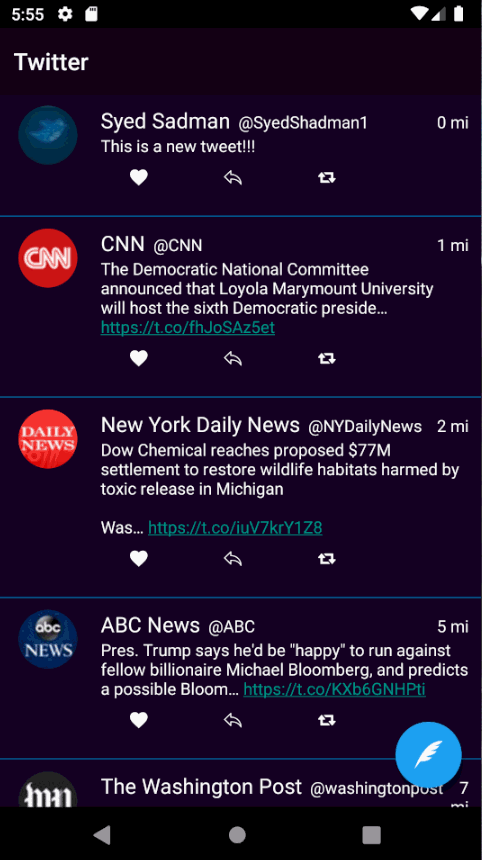

# Project 2 - *TwitterClone*

This is an android app that allows users to view their Twitter timeline and post a new tweet. The app utilizes [Twitter REST API](https://dev.twitter.com/rest/public).

# Features:

- [X] User can sign in to Twitter using OAuth login
- [X] User can compose and post a new tweet
  - [X] User can then enter a new tweet and post this to twitter
  - [X] User is taken back to home timeline with new tweet visible in timeline
  - [X] Newly created tweet should be manually inserted into the timeline and not rely on a full refresh
  - [X] User can see a counter with total number of characters left for tweet on compose tweet page
- [X] User can pull down to refresh tweets timeline
- [X] User sees an indeterminate progress indicato when any background or network task is happening
- [X] Compose tweet functionality is build using modal overlay

## Video Walkthrough

Here's a walkthrough of implemented user stories:

GIF created with [LiceCap](http://www.cockos.com/licecap/).

## Notes

## Open-source libraries used

- [Android Async HTTP](https://github.com/codepath/CPAsyncHttpClient) - Simple asynchronous HTTP requests with JSON parsing
- [Glide](https://github.com/bumptech/glide) - Image loading and caching library for Android

## License

    Copyright [2019] [Syed Sadman]

    Licensed under the Apache License, Version 2.0 (the "License");
    you may not use this file except in compliance with the License.
    You may obtain a copy of the License at

        http://www.apache.org/licenses/LICENSE-2.0

    Unless required by applicable law or agreed to in writing, software
    distributed under the License is distributed on an "AS IS" BASIS,
    WITHOUT WARRANTIES OR CONDITIONS OF ANY KIND, either express or implied.
    See the License for the specific language governing permissions and
    limitations under the License.
